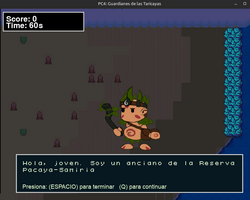

# Proyecto Juego 2D Salva a las Taricaya!
Proyecto de Computación Gráfica usando PyGame con la temática de salvar a las tortugas Taricaya

## Para probar el juego: 
https://dgafecb.itch.io/ttaricaya

## Para utilizar el proyecto:

``pip install -r requirements.txt``

``python main.py``

o si desea levantarlo en un servidor local:

``pygbag main.py``

## Previews:
### Nivel 1: Noche
 
 
### Nivel 2: Dia
 
 